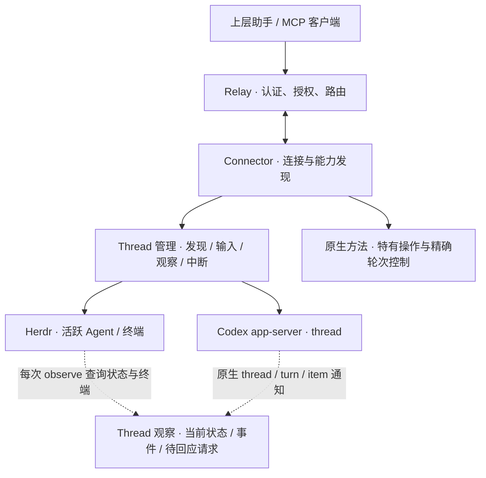

# Agent 管理服务的统一接口

面向调用者的流程见[管理 Agent 会话](../docs/management.zh-CN.md)，适配器的原生版本约束见[接口依据](agent-management-interface-audit.zh-CN.md)。

## 目标与对象

Agenvo 对接管理 Agent 的服务。上层助手发现已有会话、创建工作上下文、发送输入、观察进展，并按后端能力回答问题、中断、恢复和归档。接入范围是整个获准服务，包括其他客户端创建的上下文。仅提供命令、容器、SSH 或进程执行的环境不属于这一抽象。

统一管理单位是 Thread：可寻址、可持续交互的 Agent 工作上下文。原生执行轮次作为输入确认、事件证据和后端控制参数保留，不建立公共 Run 对象，也不建立另一套任务数据库。上层业务目标可能跨多轮输入，原生轮次完成不能说明业务成功。

| 对象 | 契约 | Herdr 映射 | Codex 映射 |
| --- | --- | --- | --- |
| 服务引用 `serviceRef` | 在获准实例内明确选择一个管理服务 | config root 下的 session 与 backendGeneration | 特定 app-server 连接和获准 home |
| 会话引用 `threadRef` | 可继续交互的工作上下文，不要求独立进程或持久历史 | 活跃 Agent，保留 terminal、pane、workspace 和原生 session 身份 | thread，持久性取决于原生历史模式及 ephemeral 设置 |
| 交互引用 `interactionRef` | 需要回答的原生请求，绑定连接代次 | 无可靠的共同结构化请求身份 | Connector 收到的 server request |

引用不透明，由适配器签名，绑定实例、对象种类和适配器代次。重启或 Codex 连接重建后需要重新发现；原生 thread ID 仍可用于发现持久上下文。引用失效不意味着原生上下文被删除。

Herdr 的名称和 pane 会复用。引用保留 terminal_id、Agent kind、可用的 agent_session 及服务代次；操作前检查目标。原生终端输入没有原子身份前置条件，查询与输入之间仍有竞争窗口，不能宣称完全避免误投。启动中的引用额外绑定目标 pane 与类型，不能误认同名新对象或掩盖启动失败。

原生服务拥有执行、历史和会话生命周期。Herdr 独立启动；Connector 不提供其 session.start/stop。Codex managed-stdio 管理显式创建的子进程，attach-unix 只连接已有 app-server，关闭 Connector 不停止附着服务。

## 管理接口

保留 `instances_list`、`instance_describe`、`runtime_call` 三个 MCP 工具。共同接口使用 `management.*`，原生方法继续处理服务特有行为。Relay 无需理解 Thread 或原生 turn。`instance_describe` 的 `managementVersion: 1`、能力及方法 schema 是实际可调用范围。

| 方法 | 调用者可观察的契约 |
| --- | --- |
| `management.services.list` | 发现服务；磁盘端点存在不等于连通 |
| `management.threads.list` | 发现当前上下文，包括其他客户端创建的对象；发现不自动订阅 |
| `management.threads.create` | 创建上下文，不发送初始提示词；Herdr 异步返回启动查询 |
| `management.threads.get` | 查询元数据和活动状态 |
| `management.threads.send` | 提交文本，保留原生确认和忙碌输入语义，不承诺新轮或排队 |
| `management.threads.observe` | 查询该 Thread 当前状态、分页观察事件及待回应请求摘要 |
| `management.threads.read` | 按需读取原生历史或终端快照，与观察游标独立 |
| `management.threads.interrupt` | 请求中断当前原生执行，不重选目标或重试；Codex 与 Lody 保留轮次身份，Amp 使用无轮次前置条件的原生 cancel |
| `management.threads.resume` | 加载并订阅已有上下文，不发送提示词；仅 Codex 支持 |
| `management.threads.archive/unarchive` | 改变可见性，不等同取消或销毁；仅 Codex 支持 |
| `management.interactions.list/read/respond` | 按 Thread 列出待回应请求，按交互引用读取或回答；Codex、Paseo 与 Lody 支持 |

没有公共执行引用、执行资源查询、实例级观察列表或统一 steer。精确轮次操作继续使用原生 `turn/steer`、`turn/interrupt` 和 `thread/items/list`。这样原生轮次身份留在需要它的边界，而普通管理方只维护 Thread 和观察游标。

Herdr 的原生 agent.prompt 写入终端；Codex send 调用 turn/start。同一个方法不承诺“新的一轮”。对活跃 Codex 轮次追加指令且要求身份匹配时，调用原生 turn/steer；expectedTurnId 不匹配时原生拒绝。没有经验证的原生契约就不增加下一轮队列或自动重发。

## Thread 观察

`observe(threadRef, cursor?, limit?)` 返回 `thread`、`items`、`interactions`、`nextCursor`、`caughtUp`、`gap` 和 `coverage`。Thread 状态、事件与待回应请求分别采样，不是同一时刻的原子快照。调用方持续传回 nextCursor；caughtUp 只说明当前缓冲已读完。

三种事实保持独立：

- 可访问性：Connector 或服务是否连通；离线期间原生工作可能继续。
- 活动状态：starting、idle、working、blocked、unknown，附原生状态、观察时间和来源。Herdr done 归为空闲观察，保留 completion_seq；Codex notLoaded 和 systemError 不归为空闲。
- 原生事件结果：Codex turn/completed 可表达完成、失败或中断。事件保留原生轮次 ID 和错误，即使当前 Thread 已进入下一轮，也不能仅返回最新状态而丢失此前失败。

Connector 自动订阅已加载的 Codex Thread。首次 observe 尚未订阅的 Thread 时，调用 thread/resume（excludeTurns: true）建立订阅，不发送输入，然后读取当前元数据与该 Thread 的待回应请求。因为 resume 会加载上下文并应用全权限设置，observe 的 readOnly 标志为 false。订阅失败不伪装成空事件；归档、未持久化或原生历史不可用等失败保持原生错误。以后通过当前连接收到的通知增量观察，订阅不补发过去事件。

Herdr observe 每次主动查询 agent.get 并读取 agent.read 终端快照，不依赖先前管理调用。启动中的对象先返回启动状态，活跃后才读取终端。快照声明读取行数与有界覆盖，不转写为结构化 assistant 消息；两次采样之间的状态变化可能丢失。Connector 另外通过原生订阅把状态变化发送为 `runtime.changed` webhook，终端内容仍按需读取，详见[事件设计](events.zh-CN.md)。启动引用变为活跃引用后，调用方使用返回的新引用并重新开始游标。

Connector 使用一个有界记录，而不是为无限多个 Thread 建立持久缓存。每条记录关联原生 Thread 身份，输出分页前按目标筛选；游标包含记录代次、Thread 身份摘要和位置。跨 Thread 使用返回 invalid_cursor。其他 Thread 的事件不占当前页面条数，空页也能越过无关事件推进游标。快照和事件最多保留 256 条、512 KiB，单次事件页不超过 32 KiB；大事件截断仍保留可用的原生身份、状态和错误。完整结果还受现有 64 KiB 信封限制。

游标遇到淘汰或连接重建返回 gap。共享缓冲无法证明被丢弃事件都不属于目标，因此保守报告缺口，可能包含其他 Thread 导致的淘汰。旧 Codex 引用失效后重新发现同一个原生 Thread，旧观察游标仍能报告记录代次变化。Herdr 服务代次变化则需要新的引用与游标。缓冲不补齐断线、未订阅和进程重启期间的事件；历史恢复依赖原生能力。

`read` 返回 conversation_items 或 terminal_snapshot。Codex 按轮次分页，详细 item 通过原生接口继续读取。后端不支持历史、没有 materialized rollout、临时会话历史不可用与空结果不同，必须显式返回错误。交付物保留原生来源，不从任意终端文本推断已经验证的 artifact 清单。

## 中断、交互与故障

Codex Thread 中断先以 thread/turns/list 查询最新一条轮次元数据（desc、limit: 1、itemsView: notLoaded）。没有 inProgress 轮次时返回 no_active_execution，查询失败时不派发中断。取得 turnId 后只发送一次 turn/interrupt；不能在原生拒绝或超时后重选当前轮次，避免误中断下一轮。响应只确认请求，完成事件才说明实际结果。

Herdr 不支持这一中断契约；Esc/Ctrl+C 继续作为原生终端操作，不伪装成任务级取消。archive、interrupt 和关闭 workspace 是不同动作。Relay 或 Connector 断开不隐式取消原生工作。

Codex observe 返回该 Thread 的待回应请求摘要和 interactionRef；完整内容通过 interactions.read 获取。interactions.list 按 Thread 筛选后分页，提供原生 response schema。其分页游标与观察游标不同。动态工具调用和用户问题必须按实际 schema 回答；权限请求自动处理。其他客户端已回答、轮次结束或连接重建时，旧交互引用失效。回复成功可能只代表已提交，不能据此证明赢得原生多客户端竞争。

所有 Codex 创建、恢复和输入路径，包括 attach 模式与原生入口，强制 danger-full-access / never，权限请求自动回答。Herdr 已有终端保持自身设置；支持的新启动加入原生 bypass 参数。设备配对、远程访问授权与实例指纹仍然有效，它们不属于 Agent 执行审批。

`Outcome.execution` 描述调用交付状态：not_started、starting、accepted、rejected、unknown，与 Thread 活动和原生轮次结果分开。只有确定没有派发时才能说 not_started；断线或超时造成的执行不确定性保持 unknown。Thread/turn ID、调用关联 ID 和观察游标都不是幂等键。没有原生去重契约就不重放写操作。

## 实现归属

共同方法注册、输入校验和引用由 `management.ts` 维护；有界观察记录由 `observations.ts` 维护。`HerdrManagement` 与 `CodexManagement` 负责原生映射、观察及控制，统一方法和原生方法复用适配器传输与执行配置。Relay 只路由调用，不保存另一套任务状态。

回归测试需要保护引用归属、游标缺口、自动订阅的副作用、中断竞争和原生错误传播。测试入口与隔离要求见[贡献指南](../CONTRIBUTING.zh-CN.md)。

Amp 的共同接口映射、取消竞争和观察范围见 [Amp 原生接口依据](amp-interface-audit.zh-CN.md)。

Lody 的 workspace 服务、Session 映射及两种连接的确认边界见 [Lody 接入设计](lody-connector.zh-CN.md)。
