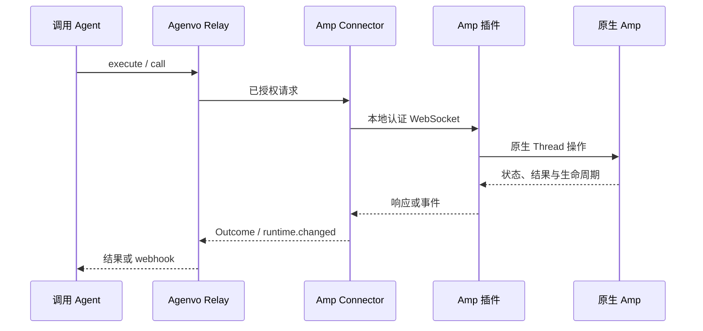

# Amp 原生接口与管理映射

Agenvo 通过公开 Plugin API 管理独立运行的 Amp 宿主，以 `amp threads list --json` 补充原生 Thread 发现。`@agenvo/amp` 是独立 Connector；不经过 Herdr，不代管 Amp 进程，也不保存另一份任务历史。当前接入为实验性，云端推理与跨设备执行尚未通过隔离账号验收。

## 接入依据

核对日期：2026-10-08。类型基线为 `@ampcode/plugin@0.0.0-20261008001818-g5d841b4`；原生测试基线为 `@ampcode/cli@0.0.1791446565-g95411c`。这些版本用于复现，不是运行时白名单。

- [Plugin API](https://ampcode.com/docs/plugin-api) 提供 `createThread`、按 ID 访问 Thread、状态订阅、完整消息读取、输入追加和取消当前轮次。
- [插件指南](https://ampcode.com/docs/customize/plugins) 定义系统插件目录、加载与释放，以及 `tool.call`、`agent.start`、`agent.end` 钩子。
- CLI 的 `threads list --json --limit N --offset N` 返回原生用户可见 Thread 数组。已用只读请求核对字段形状，包括 `id`、`title`、`updated`、`tree` 和 `messageCount`；未将个人会话内容保留为测试数据。

执行模式和 SDK 可以派发提示词，但不直接提供 Agenvo 所需的整个原生实例管理面。Plugin API 可以操作已有 Thread，因此不需要用 CLI 子进程结束来推断任务完成，也不需要本地维护任务注册表。公开 Plugin API 没有 Thread 列表接口，列表请求在宿主环境中调用公开 CLI；其登录状态应与宿主一致，不支持用不同 CLI 身份拼接一个服务。

## 职责与接口

| 管理操作 | 原生依据 | 结果边界 |
| --- | --- | --- |
| 发现服务 | 已连接插件宿主 | 通过 `hosts.list` 发现 serviceId，重连后须重新发现宿主 |
| 列出 Thread | `amp threads list --json` | 用户范围，包含其他客户端创建的 Thread，offset 非快照 |
| 创建 | `getBuiltinAgent(mode).createThread(...)` | 私有空 Thread，使用选定宿主的本地执行器，不发送提示词 |
| 查看 | `title.get()`、`state.get()` | 原生活动状态；`idle` 不代表业务成功，`error` 保留原值 |
| 发送/引导 | `appendUserMessage(..., {steer})` | 原生接受输入，不能据此断言轮次完成 |
| 中断 | `cancel()` | 无预期轮次 ID；并发推进可能取消下一轮，必须继续观察 |
| 读取 | `messages({from:'start', full:true, offset, limit})` | 包含压缩前历史，每页最多 20 条，offset 非快照 |
| 观察 | `state.subscribe` 与 `agent.start/end` | 状态按 Thread 订阅，生命周期仅来自附着宿主，不提供持久重放 |

`search` 发现宿主目录 `hosts.list` 和原生 `amp.threads.*` schema；`execute` 使用 serviceId 与原生 threadId 调用。暂不提供归档、取消归档、无输入恢复或结构化对话框回答。用户问题和插件对话框继续由原生 UI 处理。远程 Thread 的权限、执行位置和事件覆盖由 Amp 决定。

`plugin.ts` 负责原生 API、订阅和插件释放；`amp.ts` 负责认证桥接、连接生命周期和请求关联；`backend.ts` 负责安装配置。共享 Connector 和 Relay 继续负责设备配对、实例授权与 MCP。

## 生命周期、权限与故障

`instance add` 将独立插件复制到 Connector 私有目录，再在 Amp 系统插件目录安装入口。已有文件不会被覆盖。安装使用完整 schema 验证；原生入口冲突时移除本次复制的插件。Connector 只启动 loopback 监听器，通过私有端点文件提供随机 token，不启动 Amp。插件挂载后主动连接，按实际宿主 workspace 报告服务目录；配置的 cwd 不会改变附着宿主。

加载插件会为附着宿主的工具调用返回 `allow`。执行策略公开标明 `full-access-in-attached-host`；它不覆盖企业策略、其他插件的约束和其他执行器权限。设备访问授权与执行策略分别处理。插件入口可留在宿主中独立于 Connector 存活，因此 `disconnect` 不撤销原生工具钩子；删除入口并重新加载插件才会撤销。

桥接有连接数、并发请求、帧大小和订阅数量上限。每次 Connector 启动重建 token。连接断开使在途请求返回 `unknown`，不自动重放写操作，也不取消 Thread。重连使旧 serviceId 失效；调用者重新发现宿主、建立订阅，并从原生状态和历史恢复上下文。原生错误保留为 Outcome；超大结果明确返回错误，不伪造完整历史。

## 验证与缺口

- `tests/amp.test.ts` 使用真实插件、WebSocket 与确定性原生 API fixture，覆盖已有 Thread 发现、无提示词创建、发送/引导、历史分页、错误和取消、认证失败、重复所有权，以及断线后的未知结果、宿主身份失效和不重放。
- `tests/integration/amp.test.ts` 通过 HTTPS Relay、配对后的 Connector、MCP 与 webhook，覆盖创建、输入、完成通知、读取和中断。原生 API 仍为 fixture。
- `tests/packaging/release.test.ts` 在仓库外安装发行包，验证 CLI、独立插件安装、入口冲突与重复配置不覆盖原文件。
- `tests/adapters/amp-native.test.ts` 在固定版本的真实 Amp CLI 中加载发行插件，隔离环境和凭据，通过 fixture CLI 验证发现请求，再验证原生宿主释放使服务离线。

原生加载测试证明插件可以在 Amp 宿主中运行，但不证明真实云端 Thread 操作、工具执行、账号策略或跨设备控制。完整发布验收还需要隔离且已登录的 Amp 账号，经真实客户端入口完成创建、发送、工具调用、历史读取、中断和跨客户端发现。不得将本地 fixture 通过表述为这些行为已经验证。
