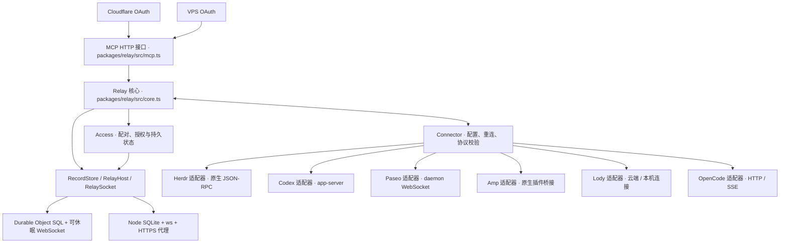

# Agenvo 架构与协议

Agenvo 将远程 MCP 请求送到用户批准的原生 Agent 管理服务。Relay 持有连接与访问授权，Connector 持有原生运行时连接，任务生命周期归各原生 Agent 服务。首版支持单所有者、多个设备、Cloudflare 和单 VPS 两种部署。

公共调用契约与扩展原则见 [MCP 与 Connector 设计原则](agent-management.zh-CN.md)，各运行时的原生语义和验证基线见 [Connector 接口依据](agent-management-interface-audit.zh-CN.md)。

## 职责与实现

`packages/relay/src/access.ts` 维护设备配对、实例指纹批准、grant 与持久授权状态。`core.ts` 维护连接 epoch、并发限制、请求关联和结果交付，协调撤销授权后的事件清理与在途调用失效。核心不依赖 Cloudflare 或 Node API。`packages/relay/src/admin.ts` 共用管理端点的校验、撤销与错误语义；未知撤销目标返回 404，不报告成功。存储事务必须同步执行，不在事务内等待网络。

Cloudflare 的 `apps/cloudflare/src/relay.ts` 实现 Durable Object 宿主与 RPC 边界，使用 SQLite records 表；`worker.ts` 提供 HTTP 与 OAuth，管理页和登录逻辑位于共享的 `packages/relay/src/admin`。VPS 的 `apps/server` 实现 Node HTTP/WebSocket、SQLite 和 MCP SDK OAuth Provider。两种 OAuth 实现使用平台各自支持的存储与协议库，共用 Relay 授权检查和 MCP 接口。

VPS 只有一个进程持有数据库排他锁。状态目录属于运行用户且权限 0700，数据库为 0600。公网 HTTPS 可以由代理或 Node TLS 提供；内部 HTTP 不构成公网明文支持。两种部署间没有自动迁移，切换需要新的设备配对和客户端授权。

## 源码阅读路径与状态归属

先按用户入口阅读，再进入对应原生服务；无需从一个大入口文件追踪全部闭包状态。

| 入口或职责 | 模块 | 持有的状态与边界 |
| --- | --- | --- |
| MCP 发现与执行 | `packages/relay/src/mcp.ts`、`catalog.ts`、`code.ts` | 发现、脚本执行与输出选择；不持有原生任务状态 |
| Relay 授权 | `packages/relay/src/access.ts`、`store.ts` | 配对、设备、grant 和同步存储事务 |
| Relay 交付 | `packages/relay/src/core.ts` | 连接 epoch、在途调用、结果交付前的授权检查 |
| Connector 安装实例 | `packages/connector/src/main.ts` | 配置锁、适配器、文件监听；启动失败与关闭统一释放 |
| Connector 连接 | `packages/connector/src/connection.ts`、`dispatch.ts`、`status.ts` | 连接独有的心跳与去重、跨重连的在途容量、串行状态落盘 |
| Connector CLI | `packages/connector/src/cli/main.ts`、`connect.ts`、`configuration.ts`、`diagnostics.ts` | 命令分派、配对流程、配置与诊断；进程信号归 CLI |
| VPS 宿主 | `apps/server/src/server.ts`、`host.ts`、`http.ts`、`store.ts` | 资源组合、套接字与定时器、HTTP 适配、数据库打开与权限 |
| Herdr 原生边界 | `apps/herdr/src/methods.ts`、`services.ts`、`startups.ts`、`herdr.ts` | 方法 schema 与 argv、原生端点与 generation、异步启动确认、调用协调 |
| Codex 原生边界 | `apps/codex-app-server/src/connection.ts`、`interactions.ts`、`native-schema.ts`、`codex.ts` | 单连接 RPC、待响应请求、原生校验、重连与订阅意图 |
| Paseo / Lody 方法 | 各自的 `paseo.ts` / `lody.ts` | 方法定义从 schema 推导 handler 参数类型；原生状态仍由各自 SDK / workspace 持有 |
| Amp / OpenCode 方法 | 各自的 `methods.ts` 与适配器 | 原生方法目录、插件桥接或 HTTP/SSE；不增加共同原生传输层 |

重连只重建连接和允许恢复的观察，不重放业务输入。Connector 在途容量由每次调用独立持有，重复 requestId 或新连接上的同名 requestId 不能释放其他调用的容量。关闭连接不会终止附着的原生服务。

协议类型与其校验 schema 放在 `packages/protocol`。两种宿主共用 `packages/relay/src/http.ts` 的配对端点，宿主先通过 `RelayAddress` 解析部署子路径，并负责请求体限制和可信客户端地址。OAuth 继续使用各平台的现有实现。

## 连接与权限

设备以本地产生的秘密进行配对。Relay 只保存摘要；所有者根据设备终端指纹批准设备及其初始实例。设备主动建立 WSS，认证成功后获得新的 epoch，同设备旧连接失效。实例 hello 包含范围指纹；新增或变更范围在再次批准前不能调用。

管理员在部署平台配置一项高熵登录密钥：Cloudflare secret `ADMIN_SECRET`，VPS 进程环境 `AGENVO_ADMIN_SECRET`。`packages/relay/src/admin/auth.ts` 共用登录、持久会话、限流、退出和 Origin 校验。网页登录生成随机的七天会话，存储只保留 token 摘要、baseUrl、到期时间和管理员密钥摘要；浏览器收到 Secure、HttpOnly、SameSite=Lax 的 `__Host-` cookie。退出删除当前会话，更换密钥使旧会话失效。密钥轮换不撤销设备或客户端授权，三种凭据生命周期独立。每个来源地址十分钟内最多十次登录尝试；错误不会回显密钥，成功登录清除该来源计数。CF 使用可信连接地址，VPS 只按显式代理配置读取来源。

管理员登录密钥至少使用 32 随机字节，编码为 hex 或 base64url；它不是用户自选的低熵口令，因此摘要比较不使用密码拉伸。比较使用定长摘要与恒时比较。BASE_URL 来自部署配置，支持任意路径前缀；地址、发现与会话契约见[任意路径前缀部署](subpath.zh-CN.md)。部署由 Wrangler/Compose/systemd 负责，CLI 不接管平台凭据与资源生命周期。

浏览器登录与 OAuth 同意分开：未登录的 `/authorize` 保留本地请求地址并跳转 `/login`；登录返回原授权页，明确同意后自动回到注册的客户端回调。返回地址只允许同 origin 的管理与授权路径。所有 cookie 授权的写操作校验准确 Origin。CF 使用 OAuth Provider 的一次性 consent handle 和浏览器绑定；VPS 将 consent handle 摘要、登录会话摘要、原授权请求与十分钟到期时间存入 SQLite，并在使用时消费。批准/拒绝都返回原 state 与匹配元数据的 issuer。OAuth token 不等同管理员会话。

`packages/relay/src/admin/management.ts` 为 CF/VPS 共用设备、实例与 grant 的网页管理。可选 CLI 管理自动化从显式的 `AGENVO_ADMIN_SECRET` 环境变量读取同一个管理员密钥，使用 Bearer 访问管理 API；它不会进入 Connector 配置或服务定义。默认 `connect` 打开网页完成配对，远程无浏览器设备只需提供配对链接和指纹。

网页采用共享的服务端 HTML 模板和样式，不加载外部字体或脚本。登录与 OAuth 授权使用聚焦布局，管理页将配对和实例批准集中为待处理请求，分别呈现连接状态与访问状态；原生范围、指纹和已撤销记录保持可查。操作沿用表单 POST 与跳转，在目标区域显示结果。浏览器对这些页面发出的 `Accept: text/html` 请求遇到错误时获得本地化的恢复页；MCP 与管理 API 保留 JSON 错误响应。

MCP 客户端通过动态注册和 S256 PKCE 授权码流程取得令牌。访问令牌 15 分钟，授权最长 30 天。VPS 将授权码、访问令牌、刷新令牌的摘要持久化；刷新令牌只用一次，重用撤销对应授权。原始令牌不进入日志。设备、实例和客户端授权均可独立撤销。

授权覆盖同一部署所有已批准实例及之后批准的实例。没有租户隔离或逐客户端实例 ACL。拥有 Herdr 访问权意味着能以设备用户身份执行命令；实例目录不是安全沙箱。受信客户端必须与用户本人具有相称权限。

## 执行语义与故障

MCP 工具只暴露 `search({query, deviceId?, instanceId?})` 和 `execute({code})`。search 用关键词查询获准实例的原生方法目录，execute 通过 call(target, method, params) 组合调用。Connector 保留原生对象、状态和身份；Codex 补充连接通知读取与待响应请求应答。没有统一管理方法层或任务状态库，终端 idle 不代表业务成功。

| execution | 语义 | 调用方动作 |
| --- | --- | --- |
| not_started | 已知尚未派发 | 修正条件后可重新发起 |
| starting | 适配器已开始异步原生操作，并提供查询标识 | 查询原生状态 |
| accepted | 原生端确认接受 | 使用原生 ID 观察任务 |
| rejected | 原生端明确拒绝 | 检查拒绝原因 |
| unknown | 无法确认操作是否已经执行 | 查询原生状态，禁止盲目重复写操作 |

单次 Relay 调用最多十秒。断线、重启、超时不会自动重放写操作，也不意味着原生任务取消。epoch 防止旧连接结果串入新连接。结果交付前再次检查授权与指纹，撤销后不交付在途结果，但不强行停止已经执行的任务。Connector 断线自动重连，运行时任务继续独立存在。

传输帧正常上限 64 KiB，解析硬上限 1 MiB；实例和查询结果分页。全局在途请求最多 64、每设备 16；设备最多 32、实例最多 128。VPS OAuth 动态客户端注册和授权码数量有界。未批准的 OAuth 注册一小时后回收，已过期的 confidential client secret 对应注册自动清理。限制用于个人部署的资源保护，不承诺抵御大规模网络攻击。

Herdr 适配器连接独立的原生服务，不提供 session.start/stop。原生 workspace、agent、pane 的操作属于用户已批准的运行时能力。Herdr 校验启动类型，Agenvo 原样转发 Agent 参数；调用者可根据实例 context 中声明的约定选择执行权限。Codex 适配器通过 Unix socket 或 loopback WebSocket 连接独立运行的 app-server，不负责原生进程的启动与停止。关闭、重启或更新 Connector 不停止原生服务及其轮次。Codex 当前在创建、恢复和输入时应用 full access，关闭沙箱与执行审批；原生权限请求自动回答。用户问题和动态工具调用仍需回答内容。

## 发布与兼容边界

兼容性只针对已正式对外发布的 Agenvo 版本。首次正式发布前，内部协议、配置和存储格式可以直接调整，调用方、测试和文档同步更新；不为内部开发版本或个人部署维护旧名称、兼容解析或迁移路径。具体维护规则见 [AGENTS.md](../AGENTS.md)。

正式版本的部署与更新方案见[由 Agent 完成部署与更新](deployment-and-updates.zh-CN.md)：search 提示 server 与 Connector 的正式版本更新，提供发行说明和可用的更新指南，由 Agent 使用现有平台工具执行安装与部署。

测试入口和环境条件见[贡献指南](../CONTRIBUTING.zh-CN.md)。

事件通过 MCP Events 的 `runtime.changed` 订阅推送，使用现有设备 WebSocket 和 Relay 持久存储。详见[原生事件驱动的观察](events.zh-CN.md)。

## 包与发行边界

仓库使用 npm workspaces。统一发行七个程序：`@agenvo/herdr`、`@agenvo/codex-app-server`、`@agenvo/paseo`、`@agenvo/amp`、`@agenvo/lody`、`@agenvo/opencode`、`@agenvo/server`。`@agenvo/protocol`、`@agenvo/connector`、`@agenvo/relay` 是私有 workspace 包，构建时进入对应发行产物，不要求使用者安装私有包。Cloudflare 是部署入口，不发布 npm 包。各包统一版本，线协议版本独立维护。

共享 Connector 不导入后端实现。每个后端拥有配置 schema、配置生成、能力版本、诊断、原生连接及生命周期行为，通过静态 Backend 接口接入共同 CLI 和连接循环。不存在动态插件注册或加载。

每个 Connector 独立配对。Herdr 与 Codex 默认目录分别是 `~/.config/agenvo/herdr` 与 `~/.config/agenvo/codex-app-server`，各有凭据、锁和系统服务。线协议中的 deviceId 表示 Connector 身份；同一物理电脑可以有多个身份。连接器之间不能复制配对凭据。

包的源码通过显式 exports 导入。共享包不依赖应用，应用之间不互相导入。构建检查防止跨应用打包；发行测试从 npm tarball 在仓库外安装，验证没有对私有包或源码路径的运行依赖。

Paseo Connector 附着已有 daemon，默认配置目录为 `~/.config/agenvo/paseo`。完整契约、原生控制动作与隔离验证见 [Paseo 接入设计](paseo-connector.zh-CN.md)。

Amp 实验性连接器通过本地鉴权 WebSocket 接收原生插件连接。每个插件宿主是独立 service，任务和历史由 Amp 持有。实现边界和证据见 [Amp 原生接口依据](amp-interface-audit.zh-CN.md)。

Lody Connector 连接云端 workspace 或附着本机 daemon，执行机器由 Lody 管理。认证、同步、RPC 和验收边界见 [Lody 接入设计](lody-connector.zh-CN.md)。
