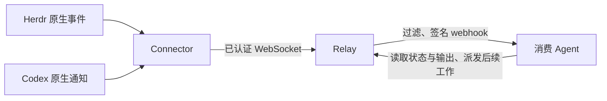

# 原生事件驱动的观察

## 决策

Agenvo 的消费者是能够理解终端和原生状态的 Agent。Agenvo 传递变化和证据，消费者判断工作是否完成、需要继续还是需要输入。`idle`、`done`、`blocked` 都是有用的通知，不要求 Agenvo 先证明业务成功。不引入 run、任务结果数据库或另一套终端状态识别规则。

Herdr 独立运行，Connector 使用它的 `events.subscribe`，跟踪 pane 生命周期和 `pane.agent_status_changed`。Codex 使用 app-server 原生通知；订阅原生 thread 后接收状态和交互变化。输出仍通过 原生读取方法和 `notifications.list` 获取，不逐 token 唤醒消费者。

## 事件与生命周期

MCP 暴露 `runtime.changed`。订阅以 deviceId、instanceId 定位实例，可按原生 serviceId、threadId、nativeTypes 缩小范围。事件携带原生类型、原生数据、发生时间及后端身份；不把所有后端强制转换为成功、失败、审批三类。身份过滤采用原生标识，不另建统一会话引用；后端重启和连接缺口需要重新检查原生状态。

订阅整个实例包含后续出现的服务和 thread。Herdr 状态推送按 pane 订阅，生命周期事件触发更新；目录发现只识别独立启动的服务。Codex 发现已加载 thread 并订阅，不批量恢复历史归档会话。原生事件与快照没有共同序号，重连通知 `agenvo.resync_required`，消费者重新发现并读取当前状态。它会通过原生类型过滤，确保消费者得知观察发生中断。

Herdr 事件历史不持久化，第一版不承诺断线期间的历史重放，MCP cursor 为 null。Relay 只持久保存有效订阅和待投递事件；重试保留 eventId，采用有限退避。事件接收可以重复或乱序，不能据此盲目重复写操作。每个订阅最多积压 64 条，整个 Relay 最多积压 256 条。队列溢出合并为重新读取状态的通知，保留每个订阅获知变化的机会，不无限积累日志。

权限沿用现有 OAuth grant、设备配对及实例指纹批准。订阅、刷新、事件入队和投递均检查当前权限；撤销、过期、取消后停止投递。回调地址和签名密钥由已授权的 MCP 客户端提供，Agenvo 信任该客户端。VPS 和 Cloudflare 共用 fetch 直接发送 HTTPS POST，域名解析、连接及证书验证交给运行平台；不增加 DNS 预检、IP 筛选或固定地址连接。签名、challenge、超时和有限重试负责协议互通与投递。回调不跟随重定向，使用两端均支持的 `redirect: "manual"`，3xx 不算投递成功。密钥不进入日志。

## 协议与部署

MCP 服务使用官方 v2 SDK 的按请求 HTTP 入口，同时保持已有 2025 客户端兼容性。ChatGPT Events 是扩展草案，SDK 尚未提供的三个 events 方法和 webhook 生命周期由 Agenvo 实现。SDK 的 SSE `subscriptions/listen` 不能代替主动 webhook。VPS OAuth 路由仍依赖 v1 SDK，因此暂时保留两个包；MCP 请求入口使用 v2。

VPS 与 Cloudflare 共用订阅和投递逻辑。Cloudflare 使用现有 Durable Object 存储、WebSocket 休眠和 alarm；不新增常驻容器或云端轮询原生状态的任务。VPS 使用本地 SQLite 和定时唤醒执行相同队列。

## 验收与测试边界

日常开发不使用维护者的 ChatGPT、Cloudflare、模型账号或正在运行的本地会话。测试生成临时 HOME、配置目录、配对凭证和 OAuth 客户端。独立 Herdr 由 fixture 启停；Codex 使用独立 CODEX_HOME 和本地模型响应服务。协议 fixture 用于制造断线、错误、重复和乱序，不能替代原生进程验证。

用户行为覆盖：授权与配对 → 发现工具和事件 → 订阅实例或 thread → 创建/发现 Agent → 派发输入 → 收到原生状态事件 → 读取输出 → 回应交互/继续工作 → 取消订阅。故障覆盖过滤、重复订阅、签名与 challenge、失效权限、刷新与重启、投递重试、断线重新观察、容量边界。测试应从公开入口发起并观察外部结果。

本地 MCP 消费者模拟平台协议和 webhook 接收，不证明 ChatGPT 的产品 UI 或调度行为。真实平台验收作为单独的发布步骤，不能成为每次回归测试的账号依赖。

## 依据

- [Herdr agents](https://herdr.dev/docs/agents/) 与 [Socket API](https://herdr.dev/docs/socket-api/)，核对 0.9.3。
- [MCP TypeScript SDK v2](https://github.com/modelcontextprotocol/typescript-sdk/blob/main/docs/migration/upgrade-to-v2.md)，核对 server 2.3.1。
- [ChatGPT MCP Events](https://developers.openai.com/plugins/build/mcp-events)，协议 2026-07-28。

