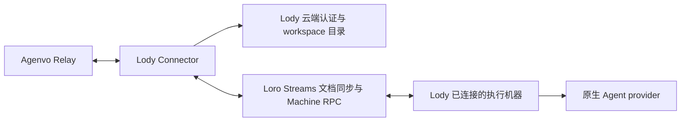

# Lody Connector 接口与实现

状态：已实现云端与本地附着两种连接。云端通过隔离 Streams 与账号/执行端 fixture 验证；本地通过原生 daemon/ACP、Codex 和隔离模型的 Relay MCP 路径验证。生产云端账号、云端版 daemon 的本机附着，以及未经测试组装的 OSS 发行物仍需单独验收。下文云端分析保留其独立边界，本地实现见末节。

## 判断

`@agenvo/lody` 作为获准 Lody workspace 的云端客户端，通过云端认证、Loro Streams 同步与 Machine RPC 管理已有及新建 Session。公开客户端源码已包含这些路径，不需要以新增 Lody 本地管理接口为前提。

Lody Session 是可寻址、可持续输入的 Agent 工作上下文，以原生 Session ID 供调用者管理工作。Connector 的部署位置与执行机器无关；执行仍由已接入 Lody 的目标机器及其 provider 承担，目标机器必须在线且调用者拥有相应访问权。

这条路径的主要成本是跟随 Lody 的文档模型、写入语义及 RPC 演进。当前核实到的是官方客户端使用的协议，不是具有独立稳定性承诺的第三方 REST 管理 API。

## 证据范围

2026-10-08 审计公开源码 `3d4787114477cf305a965da471705c8b883fa0c1`，并核对 npm `lody@0.104.0` 发布 bundle 的云端配置。源码 package.json 标记 0.100.0，GitHub latest release 标记 v0.102.0；不能假设它们与 npm 包对应同一个提交，也不能据此推断生产云端部署的确切版本。

本次没有使用个人凭据或对生产云端 Session 执行写操作。下文区分原生源码能力、当前实现及仍需生产验证的行为。

## 云端连接路径

| 环节 | 已核实接口及行为 | Connector 职责 |
| --- | --- | --- |
| 账号认证 | CLI token；`deviceAuth:validateCliToken`；Convex `deviceAuth.listMyWorkspacesForCliToken` | 校验身份，发现获准 workspace，保留原生拒绝原因 |
| Streams 授权 | `POST /api/loro-streams/token`，Bearer token，body 为 `workspaceId`；返回 token、有效期及可选 gateway/shard 配置 | 使用 workspace 专属凭据，续期并按返回配置连接 |
| 目录与历史 | `loro-repo` Streams transport、Flock 元数据及 Session 文档 | 同步获准目录，按需加载历史，解析原生 schema |
| 执行控制 | Loro Streams JSON stream 上的 Machine RPC | 按 machine ID 路由状态、dispatch、cancel、steer 等请求 |
| 活动观察 | Session 文档变更、presence、Session live-status RPC | 区分持久结果、临时在线状态与同步缺口 |

发布 bundle 配置了 `https://convex.lody.ai`、`https://backend.lody.ai` 和 `https://api.lody.ai`，分别用于不同云端职责；不能把全部请求拼到单一 API 地址。Streams endpoint 应沿用令牌返回的 `gatewayBaseUrl`、`shardHostSuffix` 及官方客户端解析规则，不能猜测固定主机名。

Machine RPC 的请求流为 `<workspaceId>:rpc:req:<machineId>`，当前客户端可共享 `<workspaceId>:rpc:res:<uuid>` 回应流。它是经云端传输到目标机器的 RPC，不要求 Connector 能直接访问执行机器。

CLI token 拥有其账号的访问能力；绑定一个 workspace 是 Agenvo 的实例范围，不意味着原始 token 被缩权为该 workspace。workspace 成员身份也不自动代表能够使用所有机器，应保留 Lody 的机器访问校验。

来源：[官方 CLI 认证说明](https://lody.ai/docs/cli/)、[workspace 查询](https://github.com/LodyAI/Lody/blob/3d4787114477cf305a965da471705c8b883fa0c1/apps/cli/src/lib/workspace.ts)、[Streams token](https://github.com/LodyAI/Lody/blob/3d4787114477cf305a965da471705c8b883fa0c1/packages/shared/src/loro-streams-auth.ts)、[文档传输](https://github.com/LodyAI/Lody/blob/3d4787114477cf305a965da471705c8b883fa0c1/packages/components/src/providers/workspace-streams-transport.ts)、[Machine RPC](https://github.com/LodyAI/Lody/blob/3d4787114477cf305a965da471705c8b883fa0c1/packages/loro-streams-rpc/src/rpc.ts)。

## Agenvo 契约映射

一个实例绑定一个明确获准的 workspace，直接暴露 Session ID，不包装 Service 或 Thread 引用。实例范围覆盖其中可访问的已有会话，包括其他客户端创建的会话；machine、project、agent config 保留为原生选择项。改变 workspace 需要更新实例范围，继续遵守 Agenvo 的授权与指纹规则。

| Agenvo 能力 | 云端实现路径 | 需要保留的边界 |
| --- | --- | --- |
| list / get / read | 同步目录及对应 Session 历史 | 未同步、不可访问和不支持的历史 backend 不能伪装成空结果 |
| create | 官方前端独立 `createSession` 路径，只写元数据并预创建文档流 | 不调用 `startSession` 或写入首条用户消息；云端可见性与空 Session 生命周期仍需验证 |
| send | 写入原生用户历史，再设置 activation pointer；Machine RPC 提供快速派发通知 | 保留 userTurnId、原生状态和忙时语义；RPC 失败不证明输入未执行 |
| observe | 文档变化、presence 与必要的 live-status RPC | 初始同步不是新发生的完成事件；断线或未覆盖区间发出 resync_required |
| cancel | 使用调用者提供的 turnId 发送 cancel RPC | 调用者从 live 或 history 读取原生轮次；拒绝或超时后不重选下一轮 |
| interactions | 读取原生 permission/question 请求，将 outcome 写回 Session 文档 | 提交回应不证明赢得多客户端竞争；用户问题不能自动当作执行审批回答 |
| 原生 steer | 带 expectedTurnId 的 steer RPC 及原生历史状态更新 | 支持程度由 provider 决定，保留 stale/unsupported/unknown 等结果 |
| 原生 archive / restore | 更新原生 Session 元数据，由 Lody 执行生命周期行为 | archive 会释放执行资源，restore 不承诺 provider resume |

**创建。** `packages/components/src/lib/session-submission.ts` 明确区分 `createSession` 和 `startSession`。前者构造 idle Session 元数据、写入目录并预创建 stream，不提交用户输入；后者才接受首条用户消息。源码因此提供了无输入创建的接入依据。但官方 UI 对空会话存在清理行为，不能仅凭元数据写入就宣称空 Session 已满足跨客户端、关闭与重连后的生命周期要求。

**发送与确认。** `session-send-delivery.ts` 将元数据、用户历史和 activation pointer 分步写入，持久化及上传独立进行。原生前端函数返回只证明其客户端接受边界，不能直接解释为云端已收到。Connector 必须核实原生同步确认及 RPC 回执，再映射 Agenvo outcome；确认丢失时返回 unknown，保留查询所需身份，不能生成新 userTurnId 重发。后续执行、原生轮次完成和业务目标完成仍是不同事实。同步副本服务于原生协议，不另建 Agenvo 任务数据库或输入队列。

**观察与交互。** presence 是短期在线状态，过期或尚未同步应保持 unknown。历史中的原生 turn 结果保留身份和错误，不能只用最新 idle 状态替代。文档更新通过 MCP events 投递，完整历史按需读取；不维护第二套观察日志。权限回应通过原生文档命令写入，仍需验证目标机器消费结果及其他客户端已回应时的行为。

**执行权限。** 新建或由 Agenvo 管理的输入路径按项目要求使用 full access，但配置必须来自具体 provider 的原生能力，不能套用一个通用 mode ID 或自动回答所有问题。账号和机器访问授权继续由 Lody 校验。Connector 退出不隐式取消 Session 或停止执行机器。

来源：[创建与首次输入](https://github.com/LodyAI/Lody/blob/3d4787114477cf305a965da471705c8b883fa0c1/packages/components/src/lib/session-submission.ts)、[写入与派发](https://github.com/LodyAI/Lody/blob/3d4787114477cf305a965da471705c8b883fa0c1/packages/components/src/lib/session-send-delivery.ts)、[交互回应写入](https://github.com/LodyAI/Lody/blob/3d4787114477cf305a965da471705c8b883fa0c1/packages/components/src/providers/workspace-writer-impl.ts)、[presence](https://github.com/LodyAI/Lody/blob/3d4787114477cf305a965da471705c8b883fa0c1/packages/components/src/providers/workspace-presence-transport.ts)、[执行生命周期](https://github.com/LodyAI/Lody/blob/3d4787114477cf305a965da471705c8b883fa0c1/apps/cli/src/session/session-execution-service.ts)。

## 实现选择与生产验收

`apps/lody` 实现专属云端适配器，复用现有 Connector 的配置、授权和原生方法目录。MCP 通过 search 发现方法，通过 execute 调用；不保留 management 包装、统一引用或状态映射。

同步及 Streams 传输复用官方 Loro 库。Lody 的 workspace 内部包不能直接视为可安装 SDK：本次 `@lody/shared` 的公开 npm 查询返回 404。实现仅适配必要的 Lody schema/RPC，具体依赖和测试范围见下节。审计提交用于追溯和测试复现，不作为运行时版本白名单。

生产验收闭环为：CLI token → workspace 与机器发现 → 读取外部已有 Session → 无输入创建 → 云端发送 → 读取结果 → 精确取消。应使用专用测试 workspace 和已连接的隔离执行机器，不使用个人现有会话。以下行为已有部分隔离覆盖，仍需在真实 Lody 环境验收：

- 空 Session 在第二个客户端可见，Connector 重启后可继续使用；创建阶段 provider prompt 次数为零，并核对原生空会话清理条件。
- 文档写入、上传确认及 RPC 回执之间断线时，不误报未派发，不重复输入；超过 Relay 调用时限时保留可查询身份。
- token 续期/撤销、workspace 或机器无权访问、机器离线、重连同步缺口均能明确报告。
- 多客户端交互竞争、provider 权限配置、原生归档副作用与关闭 Connector 后执行继续符合声明的能力。

当前实现及隔离测试支持云端协议接入；上述生产验收尚未完成，也没有官方稳定 API 承诺。

## 当前实现与验证边界

`apps/lody` 提供独立 CLI、配置与适配器。账号和 workspace 绑定实例，凭据由私有文件读取；原生认证失败与账号变更显式拒绝。协议副本保留在内存，重启后重建；历史游标记录原生 Session、位置和前一轮次身份，继续读取时验证原生历史未改变。写操作等待云端同步，未确认写入不承诺崩溃恢复。输入沿历史与 activation pointer 派发，省略非必要的 dispatch RPC 加速路径。

目录、创建、输入、历史、实时状态、订阅、交互回应、精确取消、steer、archive/restore 与大轮次读取均通过 `lody.*` 原生方法暴露。`lody.interactions.list` 返回完整待回应请求与 response schema，respond 使用原生 Session、轮次和请求 ID。`lody.sessions.subscribe` 订阅当前连接的文档更新；断线后发出 `agenvo.resync_required`，调用者重新订阅并读取历史。云端未实现独立 presence 订阅，live-status RPC 的 unknown 不会被目录元数据替代。

依赖使用 `loro-repo@0.21.1`、其声明支持的 `@loro-dev/streams-crdt@0.15.0`、`loro-crdt@1.16.3` 和 RPC 的 `@loro-dev/streams-client@0.8.0`。没有复制 Lody workspace 包或依赖未发布包，也没有沿用上游持久化补丁；内存副本不需要跨进程 cursor checkpoint。源码出处与 Apache-2.0 归属保留在 NOTICE。

`tests/lody.test.ts` 通过真实 Loro CLI 0.6.0 Streams 服务覆盖原生文档布局、空创建、历史与标记上传、交互、精确取消、回执丢失、账号绑定、token 刷新及断网恢复。`tests/integration/lody.test.ts` 从设备配对、Relay MCP 和 webhook 入口验证云端调用及事件。发行测试在仓库外安装 tarball，并通过真实 CLI 配置与 doctor 验证依赖完整性。账号 API 与机器执行使用独立 fixture，不代表真实 Lody SaaS 授权或 Codex/Claude 执行已经验收。

创建与输入沿用原生协作式配额检查，读取 workspace entitlement 并按审计版本计算 Session 数及历史/队列中的用户输入数。账单接口不可用时保持官方 CLI 的 best-effort 行为；账号与机器授权仍是必须通过的独立检查。Convex 调用使用其[公开 HTTP JSON API](https://docs.convex.dev/http-api/)格式。

## 本地附着与共享边界

一个 `@agenvo/lody` 支持 `mode: cloud | local`，实例固定路径，不自动跨路径重发输入。`LodyWorkspace` 拥有 Session 文档、历史、输入和交互语义；`CloudConnection`、`LocalConnection` 分别拥有认证/身份、传输、确认和实时状态。两种连接共用原生方法目录，调用仍受 Relay 的实例授权约束。

本地模式通过安装目录中的 daemon 运行文件和 workspace catalog 发现身份，连接原生 control、probe 与 loro-data-plane socket。Unix 校验私有运行目录归属；Windows 使用 daemon 声明的当前用户命名管道。`platform: local | cloud` 区分 OSS 与云端版安装，身份及 workspace 绑定配置。只暴露所连接机器的目录、事件与执行路径，不启动或停止 daemon，也不打开其 SQLite 数据库。

本地同步协议 v7 包含独立 peer、meta/doc/flock-doc room、版本向量、分片、presence 与 ping/pong。原生 schema 与传输实现保存在 `apps/lody/src/native`，来源为 LodyAI/Lody `a8aa4c221e9a0f6f80f6e69cb5e72718fcf66576`，Apache-2.0。该内部库未作为可安装 SDK 发布，因此保留有出处的原生实现，避免另写 CRDT 同步算法。原生协议版本不兼容应明确失败，不限制 CLI 版本号。

Agenvo 为原生传输增加 `confirmRoom`：上传后使用独立只读 peer 发起 join，核对 daemon 返回的版本向量覆盖本次写入。`local_*_received` 只确认 daemon 内存已接收，不承诺落盘、云端同步或执行完成；本地原生 `waitUntilSynced` 的发送边界不足以作此声明。确认丢失保留 Session 和 userTurnId，重连重建副本但不重发业务输入。

本地实时状态结合 `session/get-active-invocation-context` 与 presence。原生 assistant entry ID 为 `assistant:<sourceTurnId>`，可以在第一条 assistant 历史出现前精确取消已采样的活跃轮次。云端实时 RPC 没有这个身份，由调用者从原生历史选择轮次。原生可空 `endedAt` 只有数值才表示结束；权限 outcome 为 null 时仍属于待回应请求。

`tests/lody-local.test.ts` 验证接收确认、丢弃写入和断线，不把发送成功当作服务端确认；同时覆盖真实 assistant 身份和可空交互字段。`tests/system/lody-events.test.ts` 经设备配对、MCP 与 webhook，覆盖外部 Session、无输入创建、真实 Codex 模型调用、历史、精确取消、连接重建及确认丢失不重发。

npm `lody@0.104.0` 的四处平台选择被编译为 cloud，环境变量不能将它切换成 OSS。隔离 fixture 仅将这些常量组装为 local，保持原生 IPC、存储、执行与 ACP 代码不变；内置 provider 使用原生 runtime override 指向固定 Codex，模型端点为本地 mock。此验证不等同于未经改动的 OSS 发行物验收。fixture 对平台常量数量作固定基线检查，升级测试版本时需重新核对原生构建方式。
